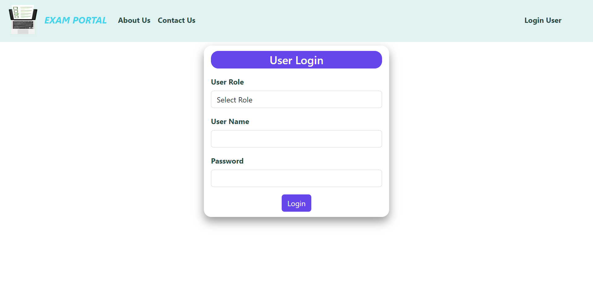
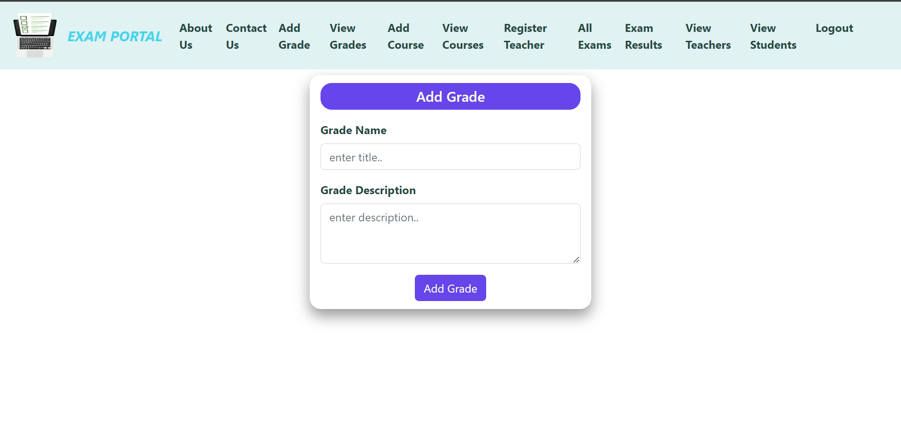
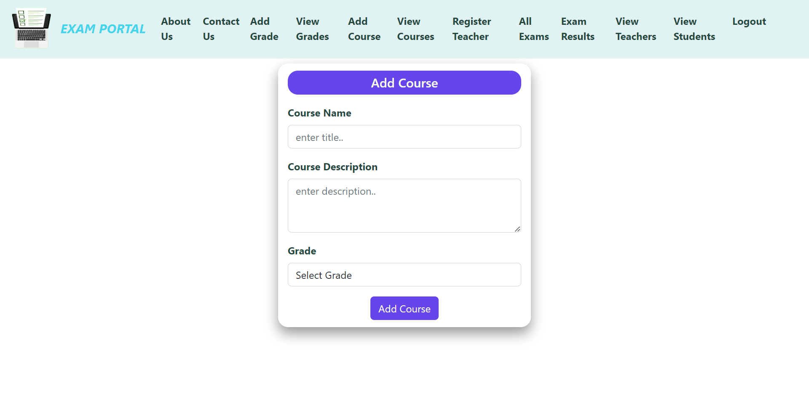
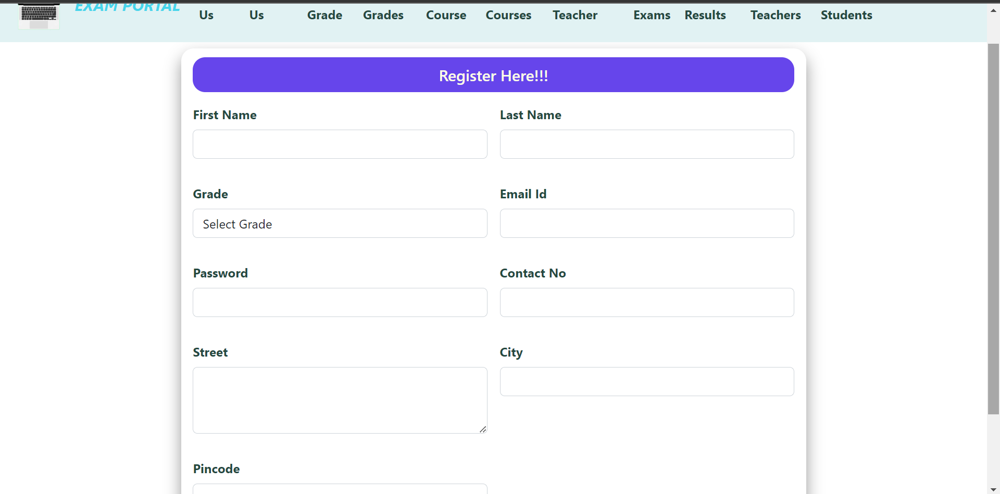
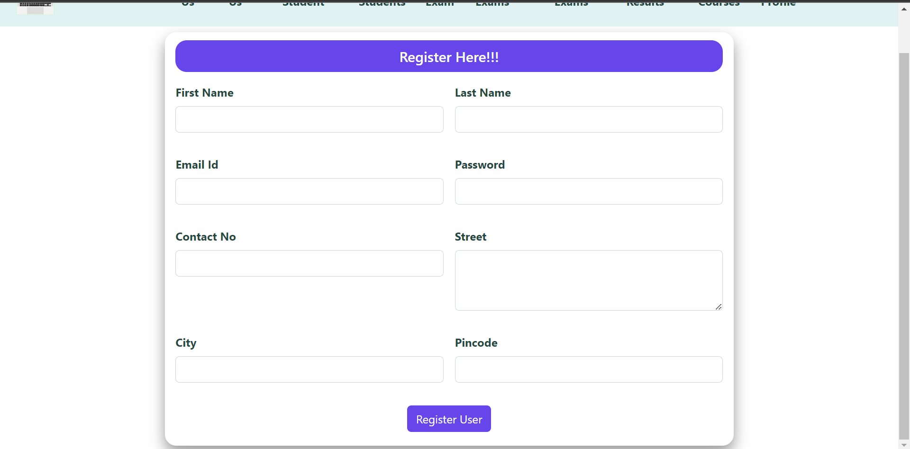
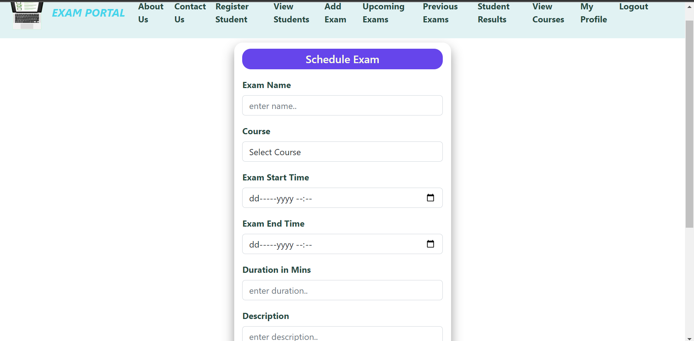

# Exam Portal

The Exam Portal, a Full Stack application built with Spring Boot and React JS, serves as a comprehensive solution for universities to manage online examinations for students. The system consists of three main modules: Admin, Teacher, and Student.

## Features

- **Administrator Module:**
  - Add and manage grades.
  - Add and manage courses within grades.
  - Register teachers for specific grades.
  - View all teachers and students.
  - Schedule exams.

- **Teacher Module:**
  - Register students in the assigned grade.
  - Schedule exams for courses.
  - View upcoming and previous exams.
  - View student results.

- **Student Module:**
  - Register for exams in their assigned grade.
  - View upcoming exams.
  - Take exams at scheduled times.
  - Receive exam results via email.
  - View exam results.

## Getting Started

Follow the steps below to set up and run the Exam Portal locally.

## Configuration

1. Copy the `application.properties.sample` file and rename it to `application.properties`.
2. Open `application.properties` and replace the placeholder values with your actual database details.

3. Copy the `docker-compose.yaml.sample` file and rename it to `docker-compose.yaml`.
4. Open `docker-compose.yaml` and replace the placeholder values with your actual database details.

### Prerequisites

- [Docker](https://docs.docker.com/get-docker/)
- [Docker Compose](https://docs.docker.com/compose/install/)

### Running the Application

1. Clone the repository:

   git clone [https://github.com/NikKnez/ExamPortal.git](https://github.com/NikKnez/Exam_Portal_Project)
   

2. Start the application using Docker Compose:

   docker-compose up
   

3. Access the application:
   - Spring Boot Backend: http://localhost:8080
   - React Frontend: http://localhost:3000

4. Stop the application:

   docker-compose down

## Screenshots

## Contributing

Contributions are welcome! Please fork the repository and create a pull request for any enhancements or bug fixes.

**Developed by [NikKnez](https://github.com/NikKnez)**
